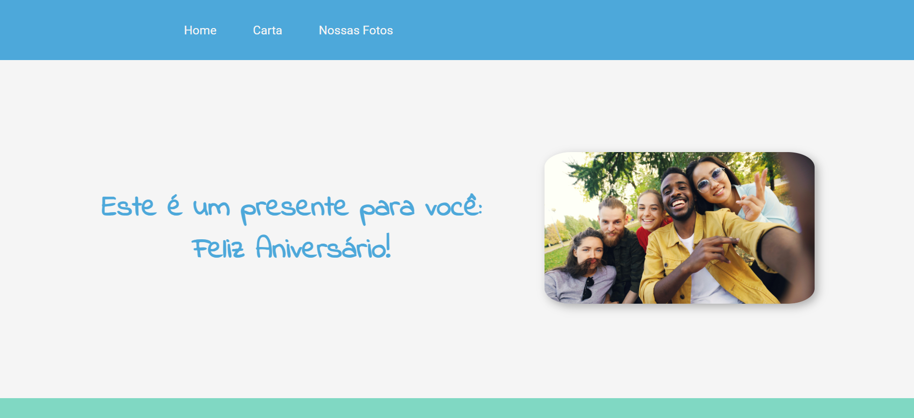

# Landing Page Aniversariante

Projeto web de uma landing page, para fins de homenagear um aniversariante. A ideia de criação dessa página veio durante o progresso no curso de HTML e CSS da Alura.

## 📂 Funcionalidades

- Responsividade para dispositivos móveis

## 🎨 Captura de Tela

## 🖥️ Visualize o projeto

[Visualize o Projeto](https://felizaniversario-lake.vercel.app/)

## ️⚙️ Tecnologias Usadas

- HTML5
- CSS3

#

Feito por [Julian Luhring](https://github.com/luhring-julian).

Este projeto foi criado para fins de aprendizado e portfólio.
